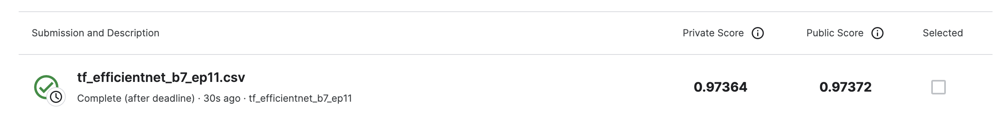

# number_images
SuperAI SS3 : Hackaton Image processing (Classification) |  Images contain number 0-9

Train - ตัวเลข 0-9 จำนวน 73,257 รูป

Test - จำนวน 1,954 รูป ต้องมีข้อมูลทั้งหมด 26,032 แถว

Metric : Categorical Accuracy (Exact Match)

Load Dataset >>> !kaggle competitions download -c hackathon-online-2022-image-processing

## Train Images

Preprocessed Images

## Test Images

Preprocessed Images

## Model - MaxViT

## Model - Efficientnet_b7
